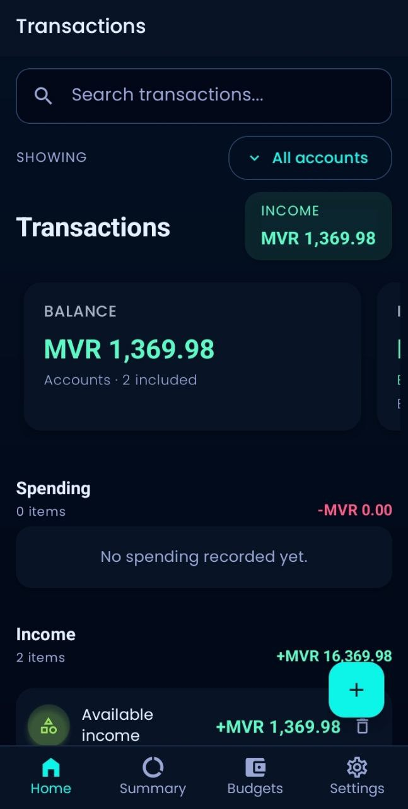
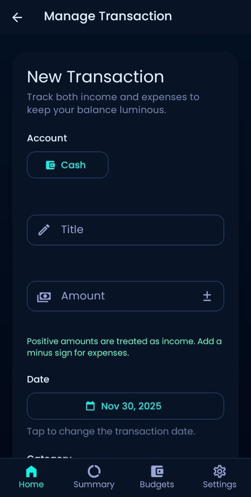
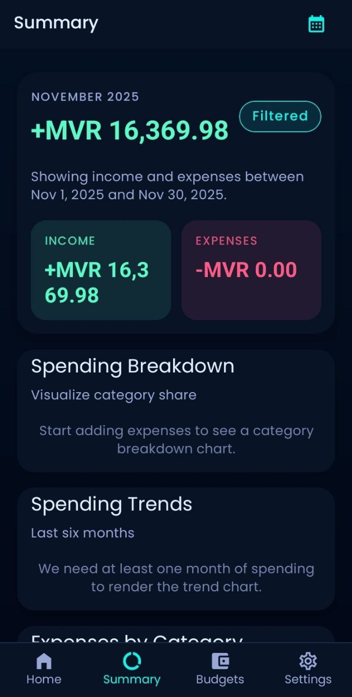
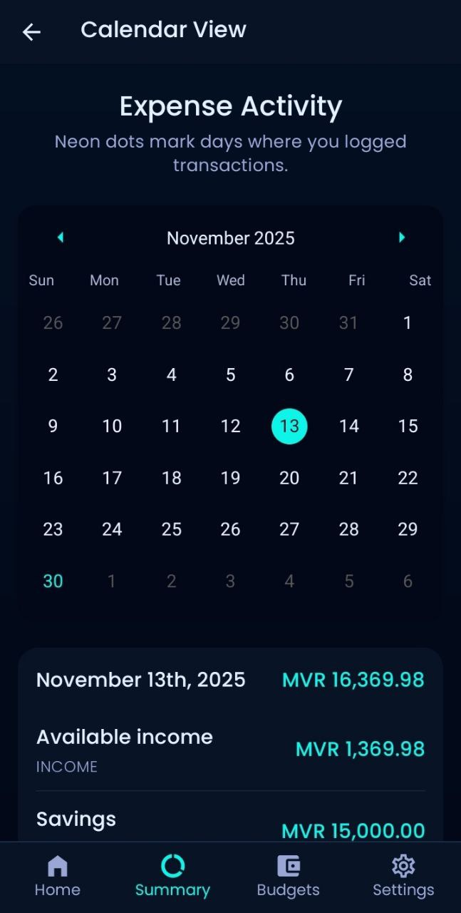
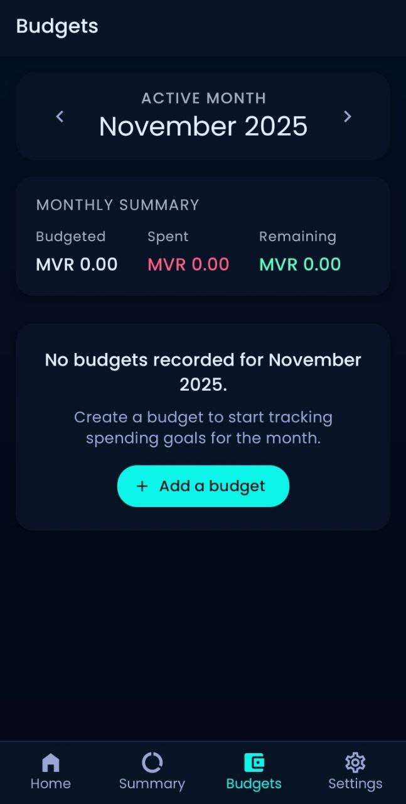
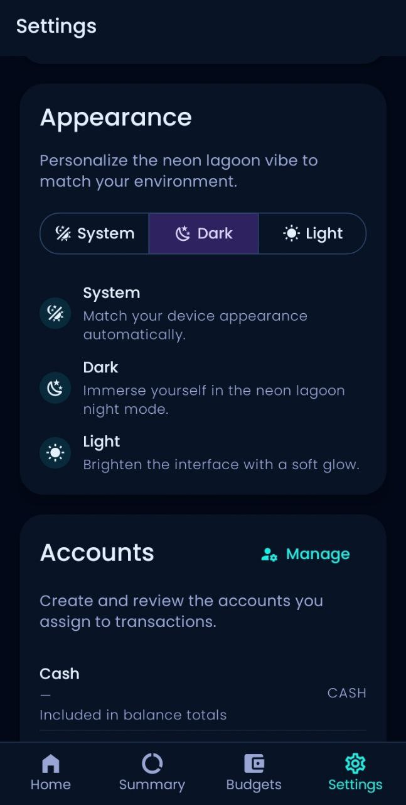

# Expense Tracker (React Native + Expo)

> A multi-tab personal finance companion that lets you log transactions, allocate budgets, visualize spending trends, and keep your data available offline.

## Overview
This project satisfies the requirements of the Mobile Application Development practical assessment by providing a fully functional React Native + Expo expense tracker. The application includes password-free onboarding, adaptive layouts, light and dark themes, persistent data storage through AsyncStorage, and contextual features such as budgets, summaries, calendars, and reminders. All navigation, state management, and data persistence specifications outlined in the assessment brief have been implemented and are detailed below.

## Table of Contents
- [Expense Tracker (React Native + Expo)](#expense-tracker-react-native--expo)
  - [Overview](#overview)
  - [Table of Contents](#table-of-contents)
  - [Assessment Alignment](#assessment-alignment)
  - [Feature Highlights](#feature-highlights)
  - [Architecture Notes](#architecture-notes)
    - [Navigation](#navigation)
    - [State Management](#state-management)
    - [Persistence Strategy](#persistence-strategy)
    - [Theming \& UI System](#theming--ui-system)
    - [Notifications](#notifications)
    - [Data Flow Snapshot](#data-flow-snapshot)
  - [Project Structure](#project-structure)
  - [Getting Started](#getting-started)
    - [Prerequisites](#prerequisites)
    - [Installation](#installation)
    - [Run in Development](#run-in-development)
    - [Platform-Specific Builds](#platform-specific-builds)
    - [Quality Gates](#quality-gates)
    - [Troubleshooting](#troubleshooting)
  - [Screenshots](#screenshots)
  - [Home / Transactions](#home--transactions)
  - [Add / Edit Transaction Flow](#add--edit-transaction-flow)
  - [Summary Dashboard](#summary-dashboard)
  - [Calendar Range Picker](#calendar-range-picker)
  - [Budgets Overview](#budgets-overview)
  - [Settings \& Theme Preferences](#settings--theme-preferences)
  - [🛠 Technologies Used](#-technologies-used)
  - [Testing \& Debugging](#testing--debugging)
  - [Known Issues \& Future Improvements](#known-issues--future-improvements)
  - [Academic Project](#academic-project)
  - [License](#license)

## Assessment Alignment
| Requirement | Evidence in App |
| --- | --- |
| UI / UX & Accessibility | Custom MD3 theme, typography and spacing defined in `theme/theme.ts`; gradients, skeleton states, and accessible touch targets across `screens/`. |
| Navigation Flow | Nested stack + tab navigators in `navigation/AppNavigator.tsx` covering Home, Summary, Budget, Settings, Calendar, and modal forms. |
| State Management | Global context (`context/AppContext.tsx`) and reducer (`context/AppReducer.tsx`) coordinate transactions, budgets, categories, filters, accounts, and theme preference. |
| Persistence | `hooks/useAsyncStorage.ts` hydrates and persists state slices; notification preferences stored via AsyncStorage (`services/notifications.ts`). |
| Core Functionality | CRUD on transactions (`AddTransactionScreen`, `HomeScreen`), budget allocation (`BudgetScreen`), calendar filtering (`CalendarScreen`), and quick analytics (`SummaryScreen`). |
| Code Quality & Documentation | Strong TypeScript types, modular folders, ESLint + TypeScript scripts, and this README describing setup, architecture, and testing paths. |
| Testing & Debugging | Manual test plan plus automation hooks via `npm run lint` and `npm run typecheck`; error boundaries and logging in hydration hooks & notification setup. |

## Feature Highlights
- **Transaction Ledger** – Capture income or expenses with category, account, notes, attachments, and validation to prevent incomplete entries (`screens/AddTransactionScreen.tsx`).
- **Smart Summary Dashboard** – View income vs. expense charts, per-category donut charts, and six-month trend bars (`screens/SummaryScreen.tsx`).
- **Calendar Filtering** – Jump to a calendar to select any date range and immediately filter the dataset (`screens/CalendarScreen.tsx`).
- **Budget Guardrails** – Define monthly budgets per category, monitor spend progress, and trigger budget alerts via Expo Notifications (`screens/BudgetScreen.tsx`, `services/notifications.ts`).
- **Account Management** – Configure bank/wallet accounts, edit friendly labels, and filter transactions by account context (`screens/ManageAccountsScreen.tsx`).
- **Personalization & Reminders** – System/light/dark theme preference, currency selection, and optional daily reminders (AsyncStorage-backed settings in `context/AppReducer.tsx`).

## Architecture Notes
### Navigation
- Bottom tab navigator hosts four primary areas (Home, Summary, Budget, Settings) while nested stack navigators expose detail screens (`navigation/AppNavigator.tsx`).
- Calendar and Manage Accounts screens are pushed on top of their parent stack to keep context.

### State Management
- `AppContext` exposes the reducer-driven global store; actions manage transactions, accounts, budgets, categories, filters, theme, and notifications.
- Derived selectors inside screens compute totals, category groupings, and chart data without duplicating state.

### Persistence Strategy
- `hooks/useAsyncStorage.ts` hydrates each state slice at boot and writes updates after hydration, guarding against race conditions.
- Budget reminder flags and preferences reuse AsyncStorage keys defined in `services/notifications.ts`.

### Theming & UI System
- `theme/theme.ts` composes a custom React Native Paper MD3 palette (primary, secondary, tertiary, success, warning) and typography based on Poppins fonts.
- `App.tsx` bridges Paper + Navigation themes and injects gesture/splash/notification bootstrap logic.

### Notifications
- `services/notifications.ts` encapsulates Expo Push Notifications for recurring reminders and one-off budget alerts, handling permissions and Android channels.

### Data Flow Snapshot
```
Transactions Screen -> AppContext.dispatch -> AppReducer -> useAsyncStorage persist -> Summary/Budget selectors -> Charts & alerts
```

## Project Structure
```
.
├── App.tsx
├── assets/
│   └── fonts/
├── components/
│   └── TransactionListItem.tsx
├── context/
│   ├── AppContext.tsx
│   └── AppReducer.tsx
├── hooks/
│   └── useAsyncStorage.ts
├── navigation/
│   └── AppNavigator.tsx
├── screens/
│   ├── AddTransactionScreen.tsx
│   ├── AddEditExpenseScreen.tsx
│   ├── BudgetScreen.tsx
│   ├── CalendarScreen.tsx
│   ├── HomeScreen.tsx
│   ├── ManageAccountsScreen.tsx
│   ├── SettingsScreen.tsx
│   └── SummaryScreen.tsx
├── services/
│   └── notifications.ts
├── utils/
│   └── currencyUtils.ts
├── package.json
└── README.md
```

## Getting Started
### Prerequisites
- Node.js 18+ (Node 20.x recommended; Node 22+ is supported here via the `node:sea` shim patch described below)
- npm 9+ (ships with Node 18) or Yarn 1.22+
- Expo CLI (`npm install -g expo-cli`) for local dev tools
- Android Studio and/or Xcode if you plan to build native binaries

### Installation
```bash
git clone https://github.com/S5ra6/Expense-Tracker.git
cd Expense-Tracker
npm install
```

### Run in Development
```bash
npm start            # Launch Expo Dev Tools + Metro bundler
```
Use the interactive prompt to run `a` (Android emulator), `i` (iOS simulator), or scan the QR code with Expo Go.

### Platform-Specific Builds
```bash
npm run android      # Gradle build via Expo Run
npm run ios          # Xcode build via Expo Run
npm run web          # React Native Web preview
```

### Quality Gates
```bash
npm run lint         # ESLint (React, React Native, TypeScript rules)
npm run typecheck    # TypeScript structural checks
```

### Troubleshooting
- **Metro fails with `node:sea` path errors on Windows** – This repo ships with a `patch-package` fix that sanitizes Colon characters when Expo generates `.expo/metro/externals` folders. The patch runs automatically after every `npm install`. If you ever delete `node_modules`, simply reinstall dependencies and rerun `npm run web`.
- **Patch was not applied** – Ensure `postinstall` ran (re-run with `npm install && npx patch-package @expo/cli`). You should see `patches/@expo+cli+0.17.13.patch` in the repo; never delete it unless upgrading Expo to a version that already includes the fix.
- **Still seeing stale assets** – Delete the `.expo` folder in the project root and restart Expo (`npm run web` or `npm start`).

## Screenshots 


## Home / Transactions 



## Add / Edit Transaction Flow 



## Summary Dashboard 



## Calendar Range Picker  



## Budgets Overview 



## Settings & Theme Preferences 



## 🛠 Technologies Used

*   **Framework:** React Native (Expo SDK 52)
*   **Language:** TypeScript
*   **UI Component Library:** React Native Paper (Material Design 3)
*   **Navigation:** React Navigation (Native Stack & Bottom Tabs)
*   **State Management:** React Context API + `useReducer`
*   **Persistence:** `@react-native-async-storage/async-storage`
*   **Charts:** `react-native-chart-kit`
*   **Date Handling:** `date-fns`
*   **Native Features:**
    *   `expo-image-picker` (Camera/Gallery)
    *   `expo-file-system` (Image caching)
    *   `expo-notifications` (Reminders)
    *   `expo-linear-gradient` (UI styling)

## Testing & Debugging
- **Smoke Tests** – Add, edit, and delete multiple transactions; restart the app to confirm hydration works.
- **Budget Alerts** – Configure a low budget, log expenses to exceed the threshold, and verify notifications fire (requires Expo push permissions).
- **Calendar Filter** – Select overlapping and disjoint ranges to ensure Summary recalculates totals correctly.
- **Error Surfaces** – Turn on Airplane Mode to see loading/error indicators around AsyncStorage hydration and network-free mode.
- **Automation Hooks** – Use `npm run lint` and `npm run typecheck` in CI to catch regressions early.

## Known Issues & Future Improvements
- **No backend sync yet** – Data lives entirely in AsyncStorage; integrating Supabase / Firebase would unlock multi-device sync.
- **Minimal automated tests** – UI logic currently validated via manual QA; Jest + Testing Library integration is planned.
- **Currency locked per profile** – Changing currency simply toggles formatting; FX conversion rules are out of scope for this release.
- **Budget notifications require foreground app start** – iOS background scheduling is limited without a native notification service extension.

## Academic Project
This is an educational project developed as part of:

- **Module**: UFCF7H-15-3 Mobile Applications Module
- **Institution**: University of West of England in association with Villa College

## License
MIT License

